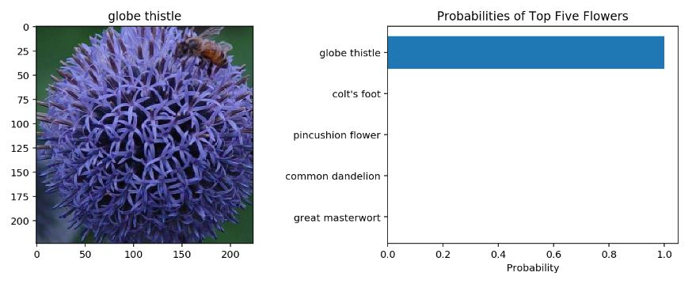

# Classify Flowers in Pytorch

The final project of Udacity's AI Programming with Python Nanodegree program. 
A classifier built to recognize different species of flowers, trained on the [102 category flower dataset](https://www.robots.ox.ac.uk/~vgg/data/flowers/102/index.html) and uses VGG-16 or AlexNet as the backbone. The project consists of a command line application and a notebook.

# ***Command Line Application***
* Clone the repository and open it in any IDE
* Run ```pip install -r requirements.txt```
* Run train.py for training the model and predict.py for making predictions
* You can change different parameters like:
  - Architecture: VGG-16 or AlexNet
  - Hyperparameters: Set hyperparamets like learning rate, epochs, hidden units
  - Device: CPU or GPU
  - Top K Classes: Predict top K classes along with associated probabilities

# ***Output Example***

